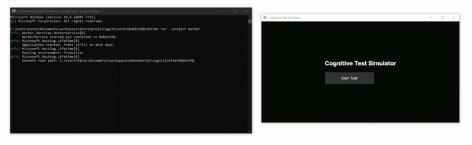

# Cognitive Test Simulator

An AI-powered quiz application that generates multiple-choice questions in real-time. The system uses a microservices architecture, with Avalonia UI for the frontend, RabbitMQ for asynchronous message brokering, and Ollama for local LLM hosting.


*Left: Avalonia UI client | Right: .NET Background Worker processing RabbitMQ queues and communicating with local LLM.*

## Architecture

The solution is divided into three main components that communicate asynchronously:

1. **Avalonia UI (Frontend):** Built with the MVVM pattern. It sends question generation requests to the broker and listens for completed questions to display to the user.
2. **RabbitMQ (Message Broker):** Handles communication between the UI and the Worker using queues.
3. **Worker Service (Backend):** A background service that handles communication between RabbitMQ, the UI and the LLM

## Prerequisites

The following software is required to build and run this project:

* .NET 10 SDK
* Docker Desktop and Docker Compose
* Ollama


## Getting Started

### 1. Start Ollama LLM
By default, the phi4-mini is required. Open a terminal and run:

```
ollama pull phi4-mini:latest
```

### 2. Start RabbitMQ
Run the following Docker Compose command to start a local RabbitMQ container with the management plugin enabled:

```
docker-compose up -d
```

You may access the RabbitMQ dashboard at http://localhost:15672 using the username and password "guest".

### 3. Start the Worker Service
Open a new terminal at the root of the solution and start the backend worker:

```
dotnet run --project Worker
```

### 3. Start the UI
Open a separate terminal at the root of the solution and launch the Avalonia application:

```
dotnet run --project UI
```